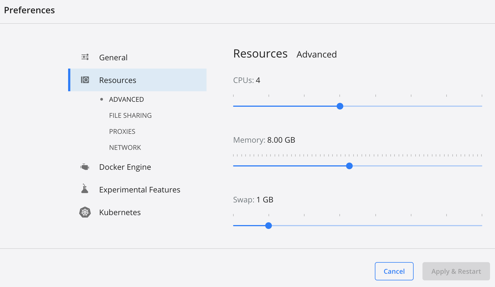

# graal-containers

## Introduction

***Credits: @krisfoster https://github.com/krisfoster/graal-containers***

This repo will walk you through building containerised apps with GraalVM JDK and Native Image.

We will be using a Spring Boot application as our test-bed. This is a fairly simple app that
generates a nonsense verse, in the style of the poem Jabberwocky (by Lewis Carrol). To do this remarkable
feat it uses a Markov chain to model the text of the original poem and this model is then used to generate random text that appear to be like the original.

## App JAR

### Build the App JAR

We have a shell script that uses multistage Docker build to build a JAR file (using `mvn`) and ship the app JAR in a separate runtime docker image.

```bash
./step0.sh
```

Run this command to see the docker image:

```bash
docker images -a
```
Here's the output of the command:
```
REPOSITORY         TAG                  IMAGE ID       CREATED       SIZE
localhost/jibber   gvmee-jdk17-0.0.1    40d34310d953   2 hours ago   613MB
```

### Run the App JAR

A Docker Compose has ben provided that will start the container, plus cAdvisor and Prometheus. Most sections have been commented out. Feel free to uncomment sections, as needed.

The other tools - cAdvisor and Prometheus - will allow us to generate pretty graphs of the RSS (Resident Set Size) for the application running in the container.

With the `jibber-gvmee-jdk17:` section uncommented, run the following command to run the app JAR.

```bash
docker-compose up -d
```

This will now start the folloing version of the app, on port 8080. Access the following URL in a browser and you should see a nonsense verse. 

* Java: http://localhost:8080/jibber

### Stop the App JAR

```bash
docker-compose stop
```

## App Native Executable

### Build the App Native Executable

You can use GraalVM Native Image to generate a native executable for this app. We have another shell script that uses multistage Docker build to build the app JAR, generate the app native executable and  ship the native executable in a separate runtime docker image.

```bash
./step1.sh
```

Run this command to see the new docker image:

```bash
docker images -a
```
Here's the output of the command:
```
REPOSITORY         TAG                  IMAGE ID       CREATED       SIZE
localhost/jibber   gvmee-native.0.0.1   daa1a94f4104   2 hours ago   196MB
```

### Troubleshoot Native Image Build Errors

You may see this error while generating the native executable.

```
Image build request failed with exit status 137
```

Exit status 137 indicates an out of memory error. Try increasing the memory for Docker resource. On Mac, go to Docker Desktop >> Settings >> Resources. Increase the memory to 8 GB or higher.

***Credits: https://stackoverflow.com/questions/68148868/micronaut-cannot-build-native-image-graalvm***




### Run the App Native Executable

Comment the `jibber-gvmee-jdk17:` section. Uncomment the `jibber-nibase` section and run the following command to run the app native executable.

```bash
docker-compose up -d
```

This will now start the following version of the app, on port 8082:

* Native Executable (generated by Native Image) : http://localhost:8082/jibber

### Stop the App Native Executable

```bash
docker-compose stop
```


## Optional: Review the Performance

You can access the app over the following URL (depending on where you run it you may need to setup port forwarding):

[Jibber Endpoint](http://localhost:8081/jibber)

Run the followinf script to get som efun stats on the container, start-up times and latency for the end point:

```bash
./stats.sh
```


## Purge all Docker Resources - Images, Containers, Volumes, and Networks

***Credits: https://www.digitalocean.com/community/tutorials/how-to-remove-docker-images-containers-and-volumes***

Docker provides a single command that will clean up any resources — images, containers, volumes, and networks — that are dangling (not tagged or associated with a container). To additionally remove any stopped containers and all unused images (not just dangling images), add the -a flag to the command:

```bash
docker system prune -a
```

## Use OCI DevOps to build the app JAR

1. Mirror the GitHub repo `DevOps Project >> Code repositories >> Mirror repository`.
2. Each time you make a change to the GitHub repo, synchornize the changes in the OCI. `DevOps Project >> Code repositories >> github_graal-containers >> Synchronize now`.
3. Create a `Build pipeline`.
4. Add a `Stage >> Managed Build` to the build pipeline.
5. Test the build pipeline by clicking the `Start manual run` button.
6. Add artifact. `localhost/jibber:gvmee-jdk17-0.0.1`
7. Add a `Stage >> Deliver artificats` after the Managed Build stage.
8. 
